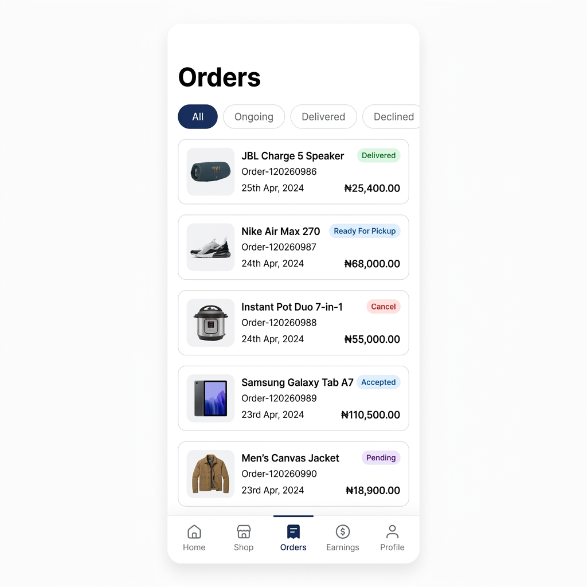
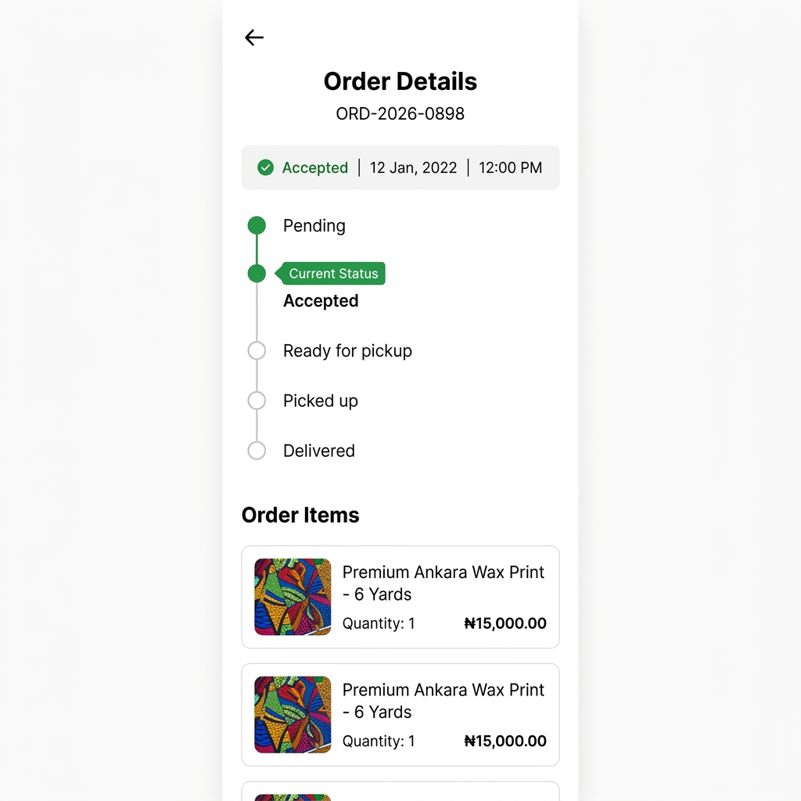

# City Commerce Platform

City Commerce is a modern, full-stack multi-vendor e-commerce ecosystem built for the Nigerian market. It connects buyers and sellers through two dedicated mobile apps backed by a scalable Express/Prisma REST API. Sellers manage their shops, orders, and earnings directly from their phone. Buyers discover products from local markets and check out seamlessly.

---

## ✨ Sellers App — Live Screenshots

| **Orders List** | **Order Detail** | **Earnings & Withdrawals** |
|:---:|:---:|:---:|
|  |  |  |
| *Filterable orders with status badges* | *Step-by-step order timeline* | *Wallet balance, escrow & transaction detail sheet* |

---

## 🏗 Project Structure

```
city_commerce/
├── backend/          # Express + Prisma REST API
├── sellers/          # Expo (React Native) — Vendor portal
├── buyers/           # Expo (React Native) — Customer marketplace
└── docs/
    └── assets/       # Screenshots & design assets
```

- **`backend/`** — Express.js server with Prisma ORM (PostgreSQL). Handles authentication, multi-vendor product management, orders, escrow wallet system, and withdrawals.
- **`sellers/`** — Expo (React Native) app for vendors to manage their shop, products, incoming orders, and earnings/withdrawals.
- **`buyers/`** — Expo (React Native) app for customers to browse markets, discover products, and purchase.

---

## 🚀 Getting Started

### Prerequisites

| Tool | Version |
|------|---------|
| Node.js | v18 or later |
| npm / yarn | latest |
| Expo CLI | `npx expo` |
| PostgreSQL | v14+ |

---

## 🛠 Setup Instructions

### 1. Backend

```bash
cd backend
npm install
```

Copy the environment file and fill in your values:
```bash
cp .env.example .env
```

Run Prisma migrations and generate the client:
```bash
npx prisma migrate dev
npx prisma generate
```

Start the development server:
```bash
npm run dev
```

The API will be available at `http://localhost:5000/api`.

---

### 2. Sellers App

```bash
cd sellers
npm install
npx expo start
```

Scan the QR code with the Expo Go app, or press `a` for Android emulator / `i` for iOS simulator.

---

### 3. Buyers App

```bash
cd buyers
npm install
npx expo start
```

---

## 🎨 Tech Stack

| Layer | Technology |
|-------|-----------|
| Mobile | React Native + [Expo](https://expo.dev/) |
| Styling | [NativeWind](https://www.nativewind.dev/) (Tailwind CSS for RN) |
| Backend | Express.js + TypeScript |
| ORM | [Prisma](https://www.prisma.io/) |
| Database | PostgreSQL |
| Auth | JWT (access + refresh tokens) |
| File Uploads | Cloudinary (signed uploads) |
| Validation | Zod |
| State Management | TanStack Query + Zustand |

---

## 🔐 Authentication

All protected routes require a `Bearer` token in the `Authorization` header:

```
Authorization: Bearer <access_token>
```

Access tokens are short-lived. Use `POST /api/auth/refresh` with a valid refresh token to obtain a new one.

---

## 📡 API Reference

**Base URL:** `http://localhost:5000/api`

All responses follow the shape:
```json
{
  "success": true,
  "message": "...",
  "data": { }
}
```

Paginated responses additionally include:
```json
{
  "meta": { "page": 1, "limit": 20, "total": 100, "totalPages": 5 }
}
```

---

### 🔑 Auth — `/api/auth`

| Method | Endpoint | Auth | Description |
|--------|----------|------|-------------|
| `POST` | `/register` | ❌ | Register a new user (SELLER or BUYER). Sends a verification email. |
| `POST` | `/login` | ❌ | Login with email & password. Returns `accessToken` + `refreshToken`. |
| `POST` | `/verify-email` | ❌ | Verify email with the 6-digit OTP sent on registration. Returns auth tokens. |
| `POST` | `/resend-verification` | ❌ | Resend the email verification OTP. |
| `POST` | `/forgot-password` | ❌ | Request a password-reset OTP via email. |
| `POST` | `/forgot-password/verify-otp` | ❌ | Verify the password-reset OTP. |
| `POST` | `/reset-password` | ❌ | Reset password using a valid OTP. |
| `POST` | `/google` | ❌ | OAuth sign-in / sign-up via Google ID token. |
| `POST` | `/refresh` | ❌ | Exchange a refresh token for a new access token. |
| `POST` | `/logout` | ✅ | Invalidate the current refresh token. |

**Register body:**
```json
{
  "firstName": "Jane",
  "lastName": "Doe",
  "email": "jane@example.com",
  "password": "Secret123!",
  "role": "SELLER"
}
```

**Login response `data`:**
```json
{
  "accessToken": "eyJ...",
  "refreshToken": "eyJ...",
  "user": { "id": "1", "email": "jane@example.com", "role": "SELLER", ... },
  "store": { "id": "5", "name": "Jane's Fashion Hub", ... }
}
```

---

### 👤 Users — `/api/users`

> All routes require authentication.

| Method | Endpoint | Role | Description |
|--------|----------|------|-------------|
| `GET` | `/profile` | Any | Get the authenticated user's full profile. |
| `POST` | `/verify-identity` | Any | Submit a KYC document (NIN / BVN / passport). |
| `PATCH` | `/account-status` | Any | Toggle the user's active status. |

---

### 🏪 Stores — `/api/stores`

> Seller only.

| Method | Endpoint | Description |
|--------|----------|-------------|
| `POST` | `/` | Create a new store (runs inside a transaction — also creates the seller wallet and bank account). |
| `GET` | `/` | Get the authenticated seller's store details including categories and market. |
| `PATCH` | `/` | Update store info (name, description, open days, times, image). |
| `GET` | `/stats` | Get store dashboard stats (order counts, revenue). |

**Create store body:**
```json
{
  "name": "Jane's Fashion Hub",
  "description": "Trendy styles for all occasions",
  "imageUrl": "https://res.cloudinary.com/...",
  "marketId": 3,
  "categoryIds": [1, 4],
  "bank": { "bankId": 12, "accountNumber": "0123456789" },
  "openDays": ["MONDAY", "WEDNESDAY", "FRIDAY"],
  "openingTime": "09:00",
  "closingTime": "18:00"
}
```

---

### 📦 Products — `/api/products`

| Method | Endpoint | Auth | Role | Description |
|--------|----------|------|------|-------------|
| `GET` | `/` | ✅ | Any | Paginated product list. Supports `?search=`, `?storeId=`, `?page=`, `?limit=`. |
| `GET` | `/:productId` | ✅ | Any | Get a single product's details. |
| `POST` | `/` | ✅ | Seller | Create a product under the authenticated seller's store. |
| `PATCH` | `/:productId` | ✅ | Seller | Partially update a product. |
| `DELETE` | `/:productId` | ✅ | Seller | Soft-delete a product. |

**Create/Update product body:**
```json
{
  "name": "Premium Ankara Wax Print - 6 Yards",
  "description": "High quality wax print fabric",
  "price": 15000,
  "imageUrl": "https://res.cloudinary.com/...",
  "categoryId": 2,
  "isAvailable": true
}
```

---

### 🏦 Banks — `/api/banks`

| Method | Endpoint | Auth | Role | Description |
|--------|----------|------|------|-------------|
| `GET` | `/` | ✅ | Any | List all supported banks. |
| `GET` | `/user-accounts` | ✅ | Seller | List the seller's saved bank accounts. |
| `POST` | `/user-accounts` | ✅ | Seller | Add a new bank account. |
| `PATCH` | `/user-accounts/:accountBankId` | ✅ | Seller | Update a saved bank account (e.g. set as selected). |
| `DELETE` | `/user-accounts/:accountBankId` | ✅ | Seller | Remove a bank account. |

**Add bank account body:**
```json
{
  "bankId": 12,
  "accountNumber": "0123456789"
}
```

---

### 💰 Wallets — `/api/wallets`

> All routes require authentication (Buyer or Seller).

| Method | Endpoint | Description |
|--------|----------|-------------|
| `GET` | `/` | Get the authenticated user's wallet. Sellers get `availableBalance` + `escrowBalance`; Buyers get `creditBalance`. |
| `GET` | `/transactions` | Paginated wallet transaction history. Supports `?page=`, `?limit=`, `?from=`, `?to=` date filters. |
| `POST` | `/withdrawal` | Initiate a withdrawal from the seller's available balance to a saved bank account. |

**Wallet response (Seller):**
```json
{
  "id": "5",
  "storeId": "6",
  "availableBalance": 8000,
  "escrowBalance": 6000,
  "createdAt": "2026-05-10T00:34:58.645Z",
  "updatedAt": "2026-05-11T14:20:37.603Z"
}
```

**Transaction list item:**
```json
{
  "id": "12",
  "walletId": "5",
  "amount": 2000,
  "type": "WITHDRAWAL",
  "status": "COMPLETED",
  "reference": "WDR-uVGT5xEPvTN5DAj0h8",
  "description": "Withdrawal of 2000 to bank account",
  "userBankId": "3",
  "createdAt": "2026-05-11T17:08:00.000Z",
  "userBank": {
    "id": "3",
    "accountNumber": "0123456789",
    "bank": { "id": "12", "name": "Access Bank" }
  }
}
```

**Withdrawal body:**
```json
{
  "amount": 2000,
  "bankAccountId": "3"
}
```

**Transaction types:**

| Type | Direction | Meaning |
|------|-----------|---------|
| `ESCROW_CREDIT` | ➕ Credit | A buyer's payment entered your escrow balance |
| `ESCROW_RELEASE` | ➕ Credit | Escrow funds released to available balance after 72 h |
| `WITHDRAWAL` | ➖ Debit | You withdrew funds to your bank account |

**Withdrawal status values:** `PENDING` · `PROCESSING` · `COMPLETED` · `FAILED`

---

### 🛒 Orders — `/api/orders` *(via store stats)*

Orders are managed through the store stats endpoint and the order-group lifecycle. Order statuses flow as:

```
PENDING → ACCEPTED → READY_FOR_PICKUP → PICKED_UP → DELIVERED
```

A 72-hour escrow window starts when an order group reaches `DELIVERED`. After that window, funds move automatically from `escrowBalance` to `availableBalance`.

---

### 🌍 Markets — `/api/markets`

| Method | Endpoint | Auth | Description |
|--------|----------|------|-------------|
| `GET` | `/` | ✅ | List all available markets. |

---

### 🗂 Categories — `/api/categories`

| Method | Endpoint | Auth | Description |
|--------|----------|------|-------------|
| `GET` | `/` | ✅ | List all product categories. |

---

### 📤 Uploads — `/api/uploads`

> Cloudinary signed upload flow — the client uploads directly to Cloudinary without routing files through the server.

| Method | Endpoint | Auth | Description |
|--------|----------|------|-------------|
| `GET` | `/sign` | ✅ | Get a time-limited signed upload signature. Pass `?folder=stores\|products\|avatars\|identity`. |
| `DELETE` | `/` | ✅ | Delete a file from Cloudinary by `publicId`. |

**Sign response `data`:**
```json
{
  "signature": "abc123...",
  "timestamp": 1715000000,
  "cloudName": "your-cloud",
  "apiKey": "your-key",
  "folder": "products"
}
```

---

### ❤️ Health Check

```
GET /api/health
```
Returns `200 OK` with `{ "success": true, "message": "API is healthy", "timestamp": "..." }`.

---

## 🗄 Database Schema Overview

```
User ──┬── Store ── SellerWallet ── SellerWalletTransaction
       │               └── SellerEscrowEntry
       ├── UserWallet ── WalletTransaction
       ├── UserBank (Bank accounts)
       └── OrderGroup ── Order ── Product
                      └── OrderPayments
```

**Key design decisions:**
- All monetary fields use `Decimal(12, 2)` for precision — no `Float`.
- Escrow is held per-order in `SellerEscrowEntry`. A background job releases funds after 72 h of delivery.
- Withdrawals are recorded directly as `SellerWalletTransaction` records (type `WITHDRAWAL`) — no separate `Withdrawal` table.
- `BigInt` primary keys throughout; serialized as strings in API responses.

---

## 👥 Contributing

1. Fork the repository and create a feature branch from `main`.
2. Follow the existing code style. Run the linter before pushing:
   ```bash
   npm run lint
   ```
3. Submit a pull request with a clear description of the change.

---

## 📄 License

This project is private. All rights reserved.
