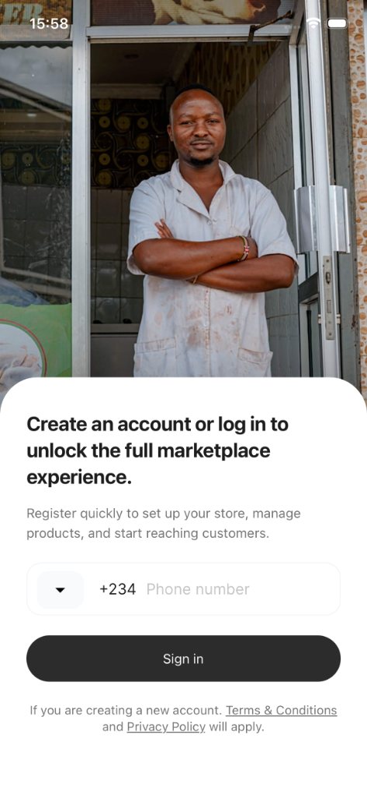
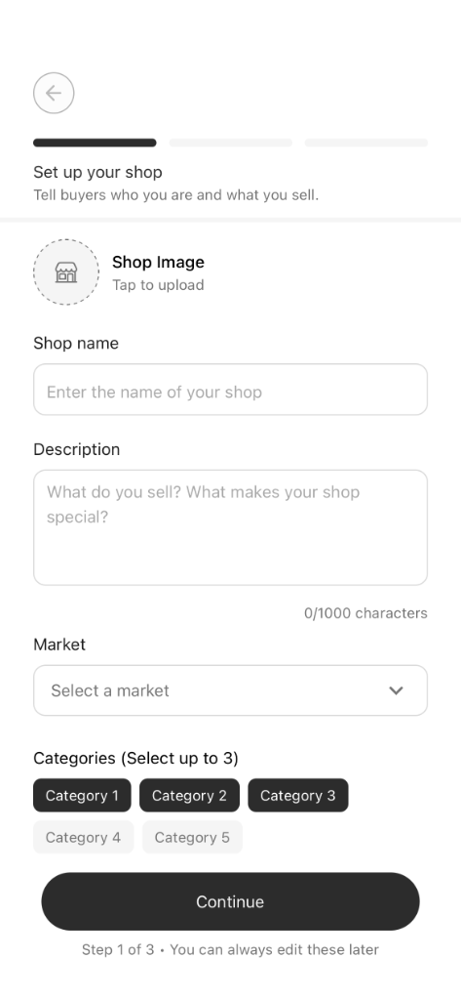
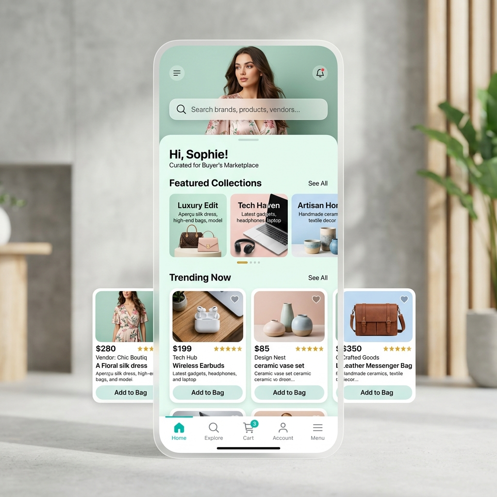

# City Commerce Platform

City Commerce is a modern, full-stack multi-vendor ecommerce ecosystem designed to connect buyers and sellers seamlessly. The platform consists of three primary components: a Seller's mobile app, a Buyer's mobile app, and a robust NestJS-powered backend.

## ✨ Visual Overview

### Sellers Application (Live Progress)
| **Onboarding** | **Shop Setup** |
|:---:|:---:|
|  |  |
| *User registration & sign-in* | *Vendor shop configuration* |

### Buyers Application (Design Concept)
| **Marketplace Feed** |
|:---:|
|  |
| *Premium shopping experience concept* |

## 🏗 Project Structure

- **`backend/`**: A NestJS server handling authentication, multi-vendor product management, orders, and payments.
- **`sellers/`**: An Expo (React Native) application tailored for vendors to manage their shops, products, and incoming orders.
- **`buyers/`**: An Expo (React Native) application for customers to browse markets, discover products, and make purchases.

---

## 🚀 Getting Started

### Prerequisites

Ensure you have the following installed on your machine:
- [Node.js](https://nodejs.org/) (v18 or later recommended)
- [npm](https://www.npmjs.com/) or [yarn](https://yarnpkg.com/)
- [Expo CLI](https://docs.expo.dev/get-started/installation/) (`npx expo`)
- [Nest CLI](https://docs.nestjs.com/) (`npm i -g @nestjs/cli`)

---

## 🛠 Setup Instructions

### 1. Backend (NestJS)
The backend provides the API infrastructure for the entire platform.

1. Navigate to the directory:
   ```bash
   cd backend
   ```
2. (In future) Initialize the project if not already done:
   ```bash
   nest new .
   ```
3. Install dependencies:
   ```bash
   npm install
   ```
4. Configure environment variables in a `.env` file (refer to `.env.example`).
5. Start the development server:
   ```bash
   npm run start:dev
   ```

### 2. Sellers App (React Native)
The dedicated portal for merchants to build and grow their business.

1. Navigate to the directory:
   ```bash
   cd sellers
   ```
2. Install dependencies:
   ```bash
   npm install
   ```
3. Start the Expo development server:
   ```bash
   npx expo start
   ```
4. Open the app using the Expo Go app on your physical device or an emulator (iOS/Android).

### 3. Buyers App (React Native)
The customer-facing marketplace for discovering and buying products.

1. Navigate to the directory:
   ```bash
   cd buyers
   ```
2. Install dependencies:
   ```bash
   npm install
   ```
3. Start the Expo development server:
   ```bash
   npx expo start
   ```

---

## 🎨 Tech Stack

- **Mobile**: React Native with [Expo](https://expo.dev/)
- **Backend**: [NestJS](https://nestjs.com/)
- **Styling**: [NativeWind](https://www.nativewind.dev/) (Tailwind CSS for React Native)
- **State Management**: React Hooks & Context API (or Redux/Zustand as the project grows)
- **Database**: PostgreSQL / MongoDB (configured via TypeORM or Mongoose in the backend)

---

## 👥 Contributing

Please ensure you follow the coding standards established in each sub-directory. Run linting and formatting before submitting pull requests.

```bash
# Example linting command
npm run lint
```
